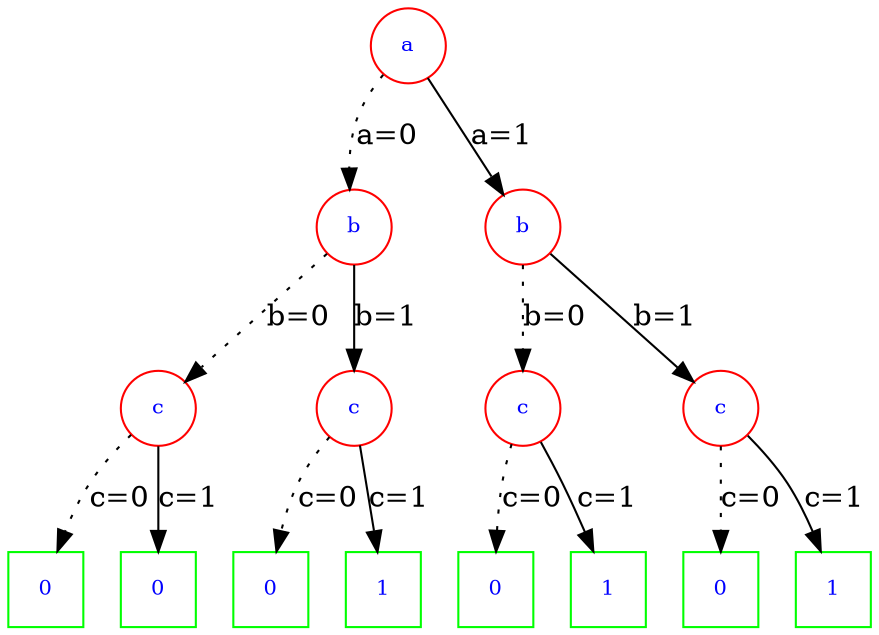
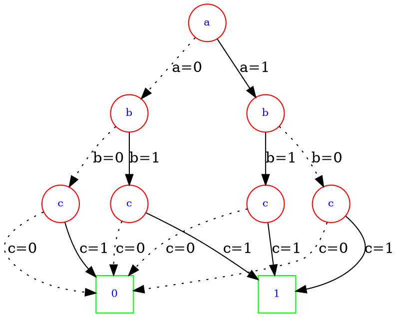
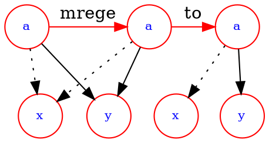
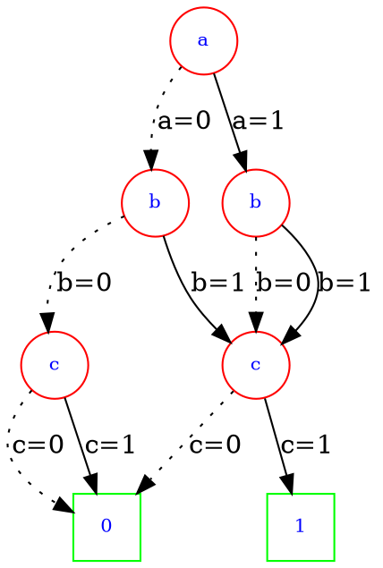
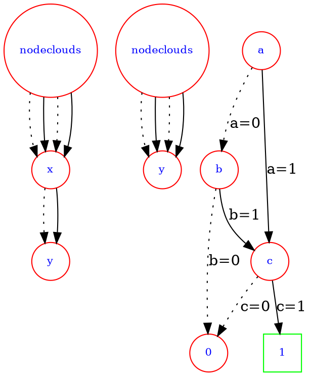
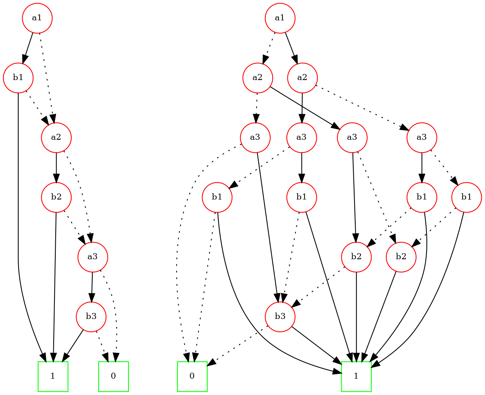

[toc]
# Boolean Algebra Basics
## Cofactor
令$F(x_1,\cdots,x_n)$为一个$n元布尔函数$
* Positive cofactor related to $x_i$
$F_{x_i}=F(x_1,\cdots,x_i=1,\cdots,x_n)$
* Negtive Cofactor related to $x_i$
$F_{x_i'}=F(x_1,\cdots,x_i=0,\cdots,x_n)$
## Cofactor properties
* 取反
$(F')_x = (F_x)'$
* 二元运算
$(F\cdot G)_x=F_x\cdot G_x$
$(F+G)_x=F_x+G_x$
$(F\oplus G)_x=F_x\oplus G_x$
## 香农展开
$$F(x_1,\cdots,x_n)=x_iF_{x_i}+x_i'F_{x_i'}$$
也可以对多个变量进行展开
$$F(x_1,\cdots,x_n)=x_ix_jF_{x_ix_j}+x_ix_j'F(x_ix_j')+x_i'x_jF_{x_i'x_j}+x_i'x_j'F_{x_i'x_j'}$$
其中$F_{x_ix_j'}=F(x_1,\cdots,x_i=1,\cdots, x_j=0,\cdots,x_n)$, 其他项依此类推。
# Boolean Difference
* 布尔函数$F$关于$x$的导数定义为
$$\frac{\partial F}{\partial x}=F_x\oplus F_{x'}$$
意义$\frac{\partial F}{\partial x}=1时，x的取值变化时F也会发生变化$
## Boolean difference properties
* 导数与变量顺序无关
 $$\frac{\partial F}{\partial x \partial y}=\frac{\partial F}{\partial y\partial x}$$
* 导数的异或等于异或的导数
$$\frac{F\oplus G}{\partial x}=\frac{\partial F}{\partial x}\oplus \frac{\partial G}{\partial x}$$
* 常量函数的导数为0
* 与和或的导数
$$\frac{\partial}{\partial x}(F\cdot G)=(F\cdot \frac{\partial G}{\partial x})\oplus (G\cdot \frac{\partial F}{\partial x})\oplus (\frac{\partial F}{\partial x}\frac{\partial F}{\partial x})$$
$$\frac{\partial}{\partial x}(F + G)=(F'\cdot \frac{\partial G}{\partial x})\oplus (G'\cdot \frac{\partial F}{\partial x})\oplus (\frac{\partial F}{\partial x}\frac{\partial F}{\partial x})$$
# Quantification Operators
## Universal quantification
$\forall_xF=F_x\cdot F_{x'}$
**意义：**$\forall_xF=1$时其他变量的值能够让$F$对于任意的$x$都是1
$e.g:令F=xy + x'z$
$F_x=y, F_{x'}=z$
$\forall_xF=F_x\cdot F_{x'}=yz$
$\forall_xF=1\Rightarrow yz=1\Rightarrow y=1, z=1$
$F_{y=1,z=1}=x+x'=1\Rightarrow \forall x都有F_{y=1,z=1}=1$
## Existential quantification
$\exist_xF=F_x + F_{x'} $
**意义：**$\exist_xF=1$ 时其他变量的值能使得存在一个 $x$ 让 $F$ 为1
$e.g:令 F=xy + x'z$
$F_x=y, F_{x'}=z$
$\exist_xF = F_x + F_{x'}= y + z$
令 $\exist_xF=1\Rightarrow y=1\ or\ z=1$
$F_{y=1}=x+x'z\Rightarrow \exist x=1\ 使得 \ F_{y=1}=1$
$F_{z=1}=xy+x'\Rightarrow \exist x=0\ 使得\ F_{y=1}=1$
## Additional properties
$\forall_{xy}F=\forall_x(\forall_yF)=F_{xy}\cdot F_{xy'}\cdot F_{x'y}\cdot F_{x'y'}$
$\exist_{xy}F=\exist_x(\exist_yF)=F_{xy} + F_{xy'} + F_{x'y} + F_{x'y'}$
# Application To Logic Network Repair
需要一个电路来实现 $f(a,b)=ab + b'$ 的逻辑功能，假设实现错了一个gate，如图中的红色框部分，需要修复它并得到它正确实现时的逻辑门。

如下图，首先将错误的gate用一个 4:1 来代替，引入了四个新的变量，我们可以将这四个新的变量取不同的值来模拟任意的逻辑门。

接下来构建一个新的逻辑函数$Z(ab,d1,d2,d3,d4)$使得它仅在 $f==G$ 时恒为1，如下图所示，只需要将 G 与 f 的正确实现进行同或即可得到相应的函数 $Z$

现在想得到的是一组mux的输入 $d0, d1, d2, d3$ 使得对于所有的 $a,b$ 都有 $Z==1$，通过universal quantification能够得到该问题的答案，即通过
$$\forall_{ab}Z=1$$
求出对应的$d_0, d_1, d_2, d_3$的取值。
上图中mux的输出
$$G(a,b,d_0, d_1, d_2, d_3)=d_0a'b+d_1b'+d_2ab$$
$$Z=G\overline{\oplus}f$$$$Z_{ab}=G_{ab}\overline{\oplus}f_{ab}$$$$Z_{ab'}=G_{ab'}\overline{\oplus}f_{ab'}$$$$Z_{a'b}=G_{a'b}\overline{\oplus}f_{a'b}$$$$Z_{a'b'}=G_{a'b'}\overline{\oplus}f_{a'b'}$$$$\forall_{ab}Z=Z_{ab}Z_{a'b}Z_{ab'}Z_{a'b'}=d_0'd_1d_2=1\Rightarrow $$$$d_0=0, d_1=1, d_2=1, d_3=x$$
如果 $d_3$ 取1，该mux实现的是一个or gate，如果 $d_3$ 取0，该mux实现的是一个exor gate，因此使用or或者exor均可实现对该网络的修复。
# Recursive tautology
## Tautology
一个布尔函数 $f$ 如果恒为真则可以将其称为tautology
## Positional Cube Notation(PCN)
用PCN来表示一个SOP形式的布尔函数，一个cube表示SOP中的单个乘积项，cube用2bit的slot来表示一个单变量
* 01表示乘积项中包含该变量
* 10表示乘积项中包含该变量的反变量
* 11表示乘积项中不包含该变量的原变量或者反变量
如 $abc, abc', bc$分别可以表示为：
$abc\ : [01\ 01\ 01]$
$abc': [01\ 01\ 10]$
$bc\ \ \ : [11\ 01\ 01]$

整个SOP用一个cube list表示，如 $f(a,b,c)=a+bc+ab$ 可以表示为：$[01\ 11\ 11], [11\ 01\ 01], [01\ 01 11]$
## Cofactor与tautology
$f$ 是 tautology 当且仅当 $f_x$ 和$f_{x'}$ 都是 tautology
**证明：**
    如果 $f()==1$ ,显然 $f_x$ 和 $f_{x'}$ 均为1
    如果 $f_x=1, f_x'=1$, 根据香农展开式有 $f()=xf_x + x'f_{x'} = x + x' = 1$  
## 判断tautology的方法
根据以上描述的tautology与cofactor的关系可以采用递归的方式来判断f是否是tautology，如果能判断出f是tautology则直接能得到结果，否则分别求出f关于某个变量的positive 和 negative cofactor，再分别判断两个cofactor是否是tautology, 这个方法被称作Unate recursive paramdigm(URP), 进行URP需要确定如下三点：
* 求Cofactor的方法
* 终止规则：什么时候可以断定 $f==1$ 或者 $f != 1$ 并终止递归
* 变量选取规则：选取哪个变量来求cofactor

### Unate recursive paramdigm
#### 求取Cofactor
布尔函数用cube list表示，求取布尔函数关于 $x$ 的cofactor需要对cube list中的每个cube根据 $x$ 在该cube中对应slot的取值进行如下操作
##### Positive cofactor：
* $x$ 对应的slot是 $10$: 将该cube从cube list中移除，因为它包含$x'$
* $x$ 对应的slot是 $01$: 将该cube中的该slot改为$11$，因为$x$取1之后该乘积项中就不包含$x$了
* $x$ 对应的slot是 $11$: 不做任何操作，因为此乘积项中不包含 $x$
##### Negative cofactor:
* $x$ 对应的slot是 $01$: 将该cube从cube list中移除，因为它包含$x$
* $x$ 对应的slot是 $10$: 将该cube中的该slot改为$11$，因为$x$取0之后该乘积项中就不包含$x$了
* $x$ 对应的slot是 $11$: 不做任何操作，因为此乘积项中不包含 $x$
#### 终止规则
* Unate function：SOP形式的布尔函数中所有变量都以同一个极性出现
$ab + ac'd + c'de'$：是unate
$xy + x'y + xyz' + z$：不是unate但是它关于变量 $y$ 是unate

**重要结论：** 一个cube list如果是unate，当且仅当它包含一个所有slot都是11的cube。
当得到一个 unate cube list 时可以采用如下终止规则
* 终止规则1: 该cube list包含所有slot都是11的cube，此时该cube list对应的布尔函数是tautology
* 终止规则2: 该cube list不包含所有slot都是11的cube，此时该cube list对应的布尔函数不是tautology

也可以增加其它的可能的终止规则，比如cube list中存在不同极性的单变量cube
#### 变量选取规则
选取most not-unate 变量
* 选取规则1：选取被最多乘积项依赖的binate变量
* 选取规则2：如果被最多乘积项依赖的binate变量有多个时，选取正变量和反变量的差值绝对值小的变量

如从如下的cube list中选取一个变量
$\begin{matrix}x &  y &  z & w\\01 & 01 & 01 & 01 \\10 & 11 & 01 & 01\\10 & 11 & 11 & 10\\ 01 & 01 & 11 & 01\end{matrix}$
根据规则一可以选出 $x$ 和 $w$ 他们都是unate且被四个乘积项依赖
然后根据规则二, $x$ 中正变量和反变量数目的差值绝对值是0，$w$ 中正变量和反变量数目的差值绝对值是2，因此 $x$ 是最终的候选。
#### 伪代码
```
IsTautology(f represent by cube list)
    if (f is unate) {
      apply unate tautology terminationn rules
      if (f is Constant 1) {
        return 1
      } else {
        return 0
      }
    } else {
        appply other termination rules
        if (f is Constant 1) {
          return 1
        } else {
          return 0
        }
        apply variable selection rules get variable x
        return IsTautology(fx) && IsTautology(fx')
    }
```
# BDD
用顶点表示变量，出边表示对该变量的一个决策(取0或者取1), 叶子节点表示布尔函数的取值，如下图表示一个三变量布尔函数的BDD

从上图中可以看出，BDD的规模与真值表的规模是一致的，随着变量的增加，其规模呈现出爆炸式增长，可以采取一些策略对BDD进行简化
## BDD简化(ROBDD)
* 合并等价的叶子节点

* 合并同构的节点



* 消除冗余节点

## BDD共享
BDD里的任意一个节点都可以表示一个布尔函数，因此如果两个布尔函数中有相同的部分，无需为该部分创建多次，只需要创建一次该结构并在多个BDD中共享。
## BDD构建
从PI遍历到PO，每一个gate都被当作一个BDD operation，保证每个operation产生的新的BDD都会reduced，ordered，shared。
## BDD的用途举例
### 判断布尔函数是否等价
只需要判断两个BDD的指针地址是否相同
### 寻找使得两个布尔函数取不同值的输入
构建出两个布尔函数相异或之后的BDD，并找出该BDD从根节点到为1的叶子节点的路径
### tautology checking
一个布尔函数如果是tautology，它的BDD是单个1节点
### SAT
判断一个布尔函数是否可满足，从该布尔函数的根节点到叶子节点的路径就是一个解，若找不到说明不可满足。
## BDD变量排序(经验方法)
* 相关的输入应该排在一起
* 对函数取值可以取决定性作用的变量应该排在一起且靠近BDD的顶部

如$a_1b_1+a_2b_2+a_3b_3$在取两种不同的变量顺序时的BDD分别为

