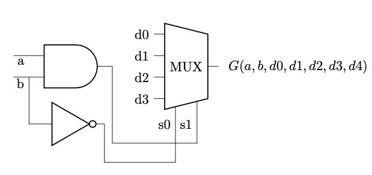
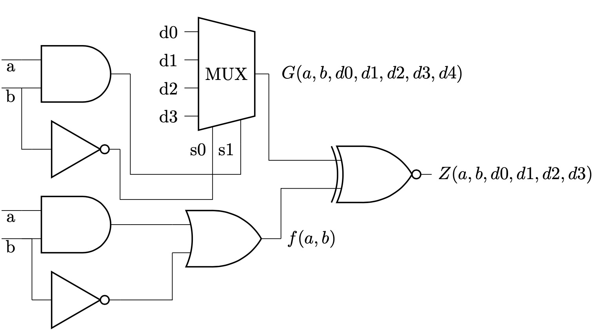
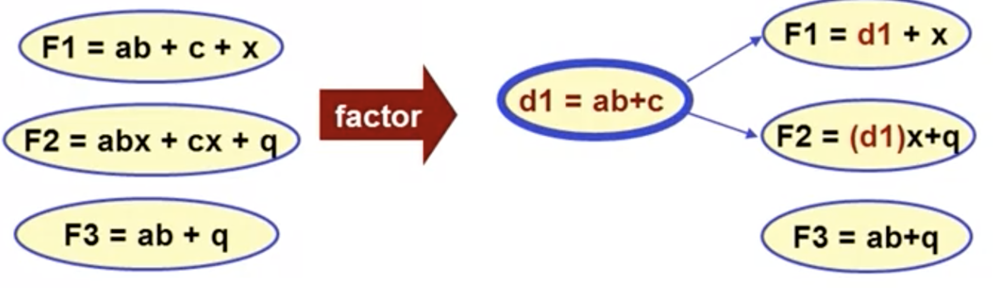

[toc]
# Boolean Algebra Basics
## Cofactor
令$F(x_1,\cdots,x_n)$为一个$n元布尔函数$
* Positive cofactor related to $x_i$
$F_{x_i}=F(x_1,\cdots,x_i=1,\cdots,x_n)$
* Negtive Cofactor related to $x_i$
$F_{x_i'}=F(x_1,\cdots,x_i=0,\cdots,x_n)$
## Cofactor properties
* 取反
$(F')_x = (F_x)'$
* 二元运算
$(F\cdot G)_x=F_x\cdot G_x$
$(F+G)_x=F_x+G_x$
$(F\oplus G)_x=F_x\oplus G_x$
## 香农展开
$$F(x_1,\cdots,x_n)=x_iF_{x_i}+x_i'F_{x_i'}$$
也可以对多个变量进行展开
$$F(x_1,\cdots,x_n)=x_ix_jF_{x_ix_j}+x_ix_j'F(x_ix_j')+x_i'x_jF_{x_i'x_j}+x_i'x_j'F_{x_i'x_j'}$$
其中$F_{x_ix_j'}=F(x_1,\cdots,x_i=1,\cdots, x_j=0,\cdots,x_n)$, 其他项依此类推。
# Boolean Difference
* 布尔函数$F$关于$x$的导数定义为
$$\frac{\partial F}{\partial x}=F_x\oplus F_{x'}$$
意义$\frac{\partial F}{\partial x}=1时，x的取值变化时F也会发生变化$
## Boolean difference properties
* 导数与变量顺序无关
 $$\frac{\partial F}{\partial x \partial y}=\frac{\partial F}{\partial y\partial x}$$
* 导数的异或等于异或的导数
$$\frac{F\oplus G}{\partial x}=\frac{\partial F}{\partial x}\oplus \frac{\partial G}{\partial x}$$
* 常量函数的导数为0
* 与和或的导数
$$\frac{\partial}{\partial x}(F\cdot G)=(F\cdot \frac{\partial G}{\partial x})\oplus (G\cdot \frac{\partial F}{\partial x})\oplus (\frac{\partial F}{\partial x}\frac{\partial F}{\partial x})$$
$$\frac{\partial}{\partial x}(F + G)=(F'\cdot \frac{\partial G}{\partial x})\oplus (G'\cdot \frac{\partial F}{\partial x})\oplus (\frac{\partial F}{\partial x}\frac{\partial F}{\partial x})$$
# Quantification Operators
## Universal quantification
$\forall_xF=F_x\cdot F_{x'}$
**意义：**$\forall_xF=1$时其他变量的值能够让$F$对于任意的$x$都是1
$e.g:令F=xy + x'z$
$F_x=y, F_{x'}=z$
$\forall_xF=F_x\cdot F_{x'}=yz$
$\forall_xF=1\Rightarrow yz=1\Rightarrow y=1, z=1$
$F_{y=1,z=1}=x+x'=1\Rightarrow \forall x都有F_{y=1,z=1}=1$
## Existential quantification
$\exist_xF=F_x + F_{x'} $
**意义：**$\exist_xF=1$ 时其他变量的值能使得存在一个 $x$ 让 $F$ 为1
$e.g:令 F=xy + x'z$
$F_x=y, F_{x'}=z$
$\exist_xF = F_x + F_{x'}= y + z$
令 $\exist_xF=1\Rightarrow y=1\ or\ z=1$
$F_{y=1}=x+x'z\Rightarrow \exist x=1\ 使得 \ F_{y=1}=1$
$F_{z=1}=xy+x'\Rightarrow \exist x=0\ 使得\ F_{y=1}=1$
## Additional properties
$\forall_{xy}F=\forall_x(\forall_yF)=F_{xy}\cdot F_{xy'}\cdot F_{x'y}\cdot F_{x'y'}$
$\exist_{xy}F=\exist_x(\exist_yF)=F_{xy} + F_{xy'} + F_{x'y} + F_{x'y'}$
# Application To Logic Network Repair
需要一个电路来实现 $f(a,b)=ab + b'$ 的逻辑功能，假设实现错了一个gate，如图中的红色框部分，需要修复它并得到它正确实现时的逻辑门。

如下图，首先将错误的gate用一个 4:1 来代替，引入了四个新的变量，我们可以将这四个新的变量取不同的值来模拟任意的逻辑门。

接下来构建一个新的逻辑函数$Z(ab,d1,d2,d3,d4)$使得它仅在 $f==G$ 时恒为1，如下图所示，只需要将 G 与 f 的正确实现进行同或即可得到相应的函数 $Z$

现在想得到的是一组mux的输入 $d0, d1, d2, d3$ 使得对于所有的 $a,b$ 都有 $Z==1$，通过universal quantification能够得到该问题的答案，即通过
$$\forall_{ab}Z=1$$
求出对应的$d_0, d_1, d_2, d_3$的取值。
上图中mux的输出
$$G(a,b,d_0, d_1, d_2, d_3)=d_0a'b+d_1b'+d_2ab$$
$$Z=G\overline{\oplus}f$$$$Z_{ab}=G_{ab}\overline{\oplus}f_{ab}$$$$Z_{ab'}=G_{ab'}\overline{\oplus}f_{ab'}$$$$Z_{a'b}=G_{a'b}\overline{\oplus}f_{a'b}$$$$Z_{a'b'}=G_{a'b'}\overline{\oplus}f_{a'b'}$$$$\forall_{ab}Z=Z_{ab}Z_{a'b}Z_{ab'}Z_{a'b'}=d_0'd_1d_2=1\Rightarrow $$$$d_0=0, d_1=1, d_2=1, d_3=x$$
如果 $d_3$ 取1，该mux实现的是一个or gate，如果 $d_3$ 取0，该mux实现的是一个exor gate，因此使用or或者exor均可实现对该网络的修复。
# Recursive tautology
## Tautology
一个布尔函数 $f$ 如果恒为真则可以将其称为tautology
## Positional Cube Notation(PCN)
用PCN来表示一个SOP形式的布尔函数，一个cube表示SOP中的单个乘积项，cube用2bit的slot来表示一个单变量
* 01表示乘积项中包含该变量
* 10表示乘积项中包含该变量的反变量
* 11表示乘积项中不包含该变量的原变量或者反变量
如 $abc, abc', bc$分别可以表示为：
$abc\ : [01\ 01\ 01]$
$abc': [01\ 01\ 10]$
$bc\ \ \ : [11\ 01\ 01]$

整个SOP用一个cube list表示，如 $f(a,b,c)=a+bc+ab$ 可以表示为：$[01\ 11\ 11], [11\ 01\ 01], [01\ 01 11]$
## Cofactor与tautology
$f$ 是 tautology 当且仅当 $f_x$ 和$f_{x'}$ 都是 tautology
**证明：**
    如果 $f()==1$ ,显然 $f_x$ 和 $f_{x'}$ 均为1
    如果 $f_x=1, f_x'=1$, 根据香农展开式有 $f()=xf_x + x'f_{x'} = x + x' = 1$  
## 判断tautology的方法
根据以上描述的tautology与cofactor的关系可以采用递归的方式来判断f是否是tautology，如果能判断出f是tautology则直接能得到结果，否则分别求出f关于某个变量的positive 和 negative cofactor，再分别判断两个cofactor是否是tautology, 这个方法被称作Unate recursive paramdigm(URP), 进行URP需要确定如下三点：
* 求Cofactor的方法
* 终止规则：什么时候可以断定 $f==1$ 或者 $f != 1$ 并终止递归
* 变量选取规则：选取哪个变量来求cofactor

### Unate recursive paramdigm
#### 求取Cofactor
布尔函数用cube list表示，求取布尔函数关于 $x$ 的cofactor需要对cube list中的每个cube根据 $x$ 在该cube中对应slot的取值进行如下操作
##### Positive cofactor：
* $x$ 对应的slot是 $10$: 将该cube从cube list中移除，因为它包含$x'$
* $x$ 对应的slot是 $01$: 将该cube中的该slot改为$11$，因为$x$取1之后该乘积项中就不包含$x$了
* $x$ 对应的slot是 $11$: 不做任何操作，因为此乘积项中不包含 $x$
##### Negative cofactor:
* $x$ 对应的slot是 $01$: 将该cube从cube list中移除，因为它包含$x$
* $x$ 对应的slot是 $10$: 将该cube中的该slot改为$11$，因为$x$取0之后该乘积项中就不包含$x$了
* $x$ 对应的slot是 $11$: 不做任何操作，因为此乘积项中不包含 $x$
#### 终止规则
* Unate function：SOP形式的布尔函数中所有变量都以同一个极性出现
$ab + ac'd + c'de'$：是unate
$xy + x'y + xyz' + z$：不是unate但是它关于变量 $y$ 是unate

**重要结论：** 一个cube list如果是unate，当且仅当它包含一个所有slot都是11的cube。
当得到一个 unate cube list 时可以采用如下终止规则
* 终止规则1: 该cube list包含所有slot都是11的cube，此时该cube list对应的布尔函数是tautology
* 终止规则2: 该cube list不包含所有slot都是11的cube，此时该cube list对应的布尔函数不是tautology

也可以增加其它的可能的终止规则，比如cube list中存在不同极性的单变量cube
#### 变量选取规则
选取most not-unate 变量
* 选取规则1：选取被最多乘积项依赖的binate变量
* 选取规则2：如果被最多乘积项依赖的binate变量有多个时，选取正变量和反变量的差值绝对值小的变量

如从如下的cube list中选取一个变量
$\begin{matrix}x &  y &  z & w\\01 & 01 & 01 & 01 \\10 & 11 & 01 & 01\\10 & 11 & 11 & 10\\ 01 & 01 & 11 & 01\end{matrix}$
根据规则一可以选出 $x$ 和 $w$ 他们都是unate且被四个乘积项依赖
然后根据规则二, $x$ 中正变量和反变量数目的差值绝对值是0，$w$ 中正变量和反变量数目的差值绝对值是2，因此 $x$ 是最终的候选。
#### 伪代码
```
IsTautology(f represent by cube list)
    if (f is unate) {
      apply unate tautology terminationn rules
      if (f is Constant 1) {
        return 1
      } else {
        return 0
      }
    } else {
        appply other termination rules
        if (f is Constant 1) {
          return 1
        } else {
          return 0
        }
        apply variable selection rules get variable x
        return IsTautology(fx) && IsTautology(fx')
    }
```
# BDD
用顶点表示变量，出边表示对该变量的一个决策(取0或者取1), 叶子节点表示布尔函数的取值，如下图表示一个三变量布尔函数的BDD

从上图中可以看出，BDD的规模与真值表的规模是一致的，随着变量的增加，其规模呈现出爆炸式增长，可以采取一些策略对BDD进行简化
## BDD简化(ROBDD)
* 合并等价的叶子节点

* 合并同构的节点


* 消除冗余节点

## BDD共享
BDD里的任意一个节点都可以表示一个布尔函数，因此如果两个布尔函数中有相同的部分，无需为该部分创建多次，只需要创建一次该结构并在多个BDD中共享。
## BDD构建
从PI遍历到PO，每一个gate都被当作一个BDD operation，保证每个operation产生的新的BDD都会reduced，ordered，shared。
## BDD的用途举例
### 判断布尔函数是否等价
只需要判断两个BDD的指针地址是否相同
### 寻找使得两个布尔函数取不同值的输入
构建出两个布尔函数相异或之后的BDD，并找出该BDD从根节点到为1的叶子节点的路径
### tautology checking
一个布尔函数如果是tautology，它的BDD是单个1节点
### SAT
判断一个布尔函数是否可满足，从该布尔函数的根节点到叶子节点的路径就是一个解，若找不到说明不可满足。
## BDD变量排序(经验方法)
* 相关的输入应该排在一起
* 对函数取值可以取决定性作用的变量应该排在一起且靠近BDD的顶部

如$a_1b_1+a_2b_2+a_3b_3$在取两种不同的变量顺序时的BDD分别为

# SAT
* 给出一个布尔函数$F(x_1,\cdots, x_n)$的适当表示
* 寻找一组输入使得$F=1$
* 如果没有可以满足的输入则给出证明并返回信息
## CNF
标准的POS形式
$$F=(a+c)(b+c)(a'+b'+c')$$上式中每一个求和项如 $a+c$ 被称作一个clause, $a, c$ 等被称作positive literal，$a', b'$ 被称作negative literal。
## Clause的状态
当对一些输入变量赋一定的值的时，CNF中的每个clause可以处于以下三种状态
* Satisfied（该clause在该赋值下为1）
* Conflicting（该clause在该赋值下为0）
* unresolved（该clause在该赋值下取值不确定）

例：给定CNF
$$F=(a+b')(a'+b+c')(a+c+d)(a'+b'+c')$$令 $a=0,b=1$，CNF 中的各个clause的状态分别为 $a+b'$ clonflicting, $a'+b+c'$ satisfied, $a+c+d$ unresolved, $a'+b'+c'$ satisified。

## Recursively方法DPLL
* Decision:
  * 选择一个变量并赋值；简化CNF
  * 如果可以确定是否SAT，则停止
* Deduction
  * 基于已有的赋值与clause的结构对CNF进行迭代的简化
  * 当不能简化时，如果可以确定是否SAT则停止，否则回溯到Decide
### Boolean constraint propagation
BCP主要用来进行上述的Deduction过程，其中最著名的策略是使用Unit clause rule
* 一个clause如果只有一个literal没有被赋值则称为**unit clause**

unit clause只有一种方式能SAT，即对该clause中未赋值赋值的literal赋1或者0（取决于该literal的极性），这一赋值操作被称作**implication**，这一implication有可能使得新的clause变为unit clause，因此又能对新的变量进行implication，如此循环的进行implication的过程被称作BCP。

例：$$F=(a+c)(b+c)(a'+b'+c')$$假设已经进行了部分赋值$a=1,b=1$,clause $(a'+b'+c')$ 为unit clause，可以进行implication得到$c=0$

### BCP终止规则
* SAT: 寻找到一组赋值使得所有的clause都为1
  * 返回结果
* Unresolved：有一个或者更多的clause 的取值不确定
  * 选择一个新的未赋值的变量对其进行新的赋值并基于新的赋值进行BCP
* Conflict：有一个或者更多的clause的取值为0
  * 回溯到最近的一次赋值操作(注意不是implication）
    * 若该变量的所有取值均已尝试过，则直接选取一个新的变量进行赋值
    * 若该变量还有其他取值未尝试过，则选择新的取值对该变量进行赋值并基于新的赋值进行BCP
## 电路等价性校验转化为SAT
假设有两个组合逻辑电路，他们的输入相同，输出数目相同，需要取check这两个电路的等价性，只需要将这两个电路对应的输出异或并将所有异或的结果相或得到一个新的多输入单输出的电路，只需要check这个电路是否SAT就能判断这两个电路是否等价。
## 组合逻辑电路转化为CNF
### Gate consistency function
假设给定一个与非门其输入与输出的关系为 $d=(ab)'$, 它的gate consistency function为$$\phi_d=[d==(ab)']=d\overline{\oplus}(ab)'=(a+d)(b+d)(a'+b'+d')$$
gate consistency function为1表征的意义是gate的输出与其由输入表达的逻辑应该一致。
### 各种gate的gate consistency function
$z=x\rightarrow (x' + z)(x + z')$
$z=x'\rightarrow (x+z)(x'+z')$
$z=NOR(x_1,\cdots,x_n)\rightarrow (\sum_{i=1}^nx_i + z)\prod_{i=1}^n(x_i'+z')$
$z=OR(x_1,\cdots,x_n)\rightarrow (\sum_{i=1}^nx_i + z)\prod_{i=1}^n(x_i'+z)$
$z=NAND(x_1,\cdots,x_n)\rightarrow (\sum_{i=1}^nx_i' + z')\prod_{i=1}^n(x_i+z)$
$z=AND(x_1,\cdots,x_n)\rightarrow (\sum_{i=1}^nx_i' + z)\prod_{i=1}^n(x_i+z')$
### 转化方法
将该组合逻辑电路(单输出)的输出变量与该电路中所有gate的gate consistency function相与即可得到该组合逻辑电路的CNF表示。
# Two level logic
Two level logic指的是使用SOP形式的电路来表示一个布尔逻辑函数，它只需要两级电路即可以表达任意的布尔逻辑，第一级用若干个与门，第二级使用一个或门将所有第一级所有与门的输出相或。
## Two level minimization
寻找一个two level logic的最优表示形式，使得所使用的与门的数目最少, 但是要寻找一个最优解太难实现，因此退而求其次尽可能的求到一个比较优的解。

如上图是一个最优解和一个相对较优的解的卡诺图表示，他们都是使每一个product项“尽可能的大”，这些“尽可能的大”的product项被称作**Primes**，最优解一定是Primes的覆盖（result from 1950s），可以看出这两个解都是irredundant，即不能通过移除一个prime而获得更优的解。
## Reduce-Expand-Irredundant optimization
假设以下面的卡诺图作为开始

* Expand：扩充每个cube使其尽可能的大,即让它变为prime

* Irredundant：移除redundant cube，该cube中的所有的1均被其他的cube所覆盖则称该cube是redundant的，经过irredundant之后所有的cube仍然是prime

* Reduce：reduce步骤尽可能的缩小每个cube但是仍然保证所有的1都被覆盖，经过reduce之后cube可能不是prime


执行完这一个循环之后如果再执行expand irredundant，可能能够得到一个更优的解。


### Expand step detail
expand的意思是从cube的移除一些变量，即将PCN中一些变量对应的slots变为11
#### Build off set
给定一个函数$F$, 构建该函数中0的cube cover，这些cubes被称作off set，在expand过程中不能触碰到这些cube，可以使用URP complement来获取一个函数的Off set
#### Build the blocking matrix
* 每一行表示cube中待expand的变量
* 每一列表示off set中的一个cube
* 如果行中的变量的极性与列中的极性不一致则该位置为1，否则为0

blocking matrix 中的1表示该1所在的行所对应的变量只要存在就能够不触碰该1所在的列对应的cube，寻找该blocking matrix的一个覆盖并将在该覆盖下所选择的行所对应的变量保留下来即可得到该cube的一个expansion。
#### 矩阵覆盖
矩阵中只有0和1，从中选取最少的行使得每一列至少有一个1被某一行所覆盖。
# Multi-level logic
Two level logic的delay通常很低，但是他的面积相对较大，multi-lelve logic可以在面积和delay上进行trade-off。
## Boolean logic network model
boolean logic network类似gate logic电路图，不过这个图中的每个节点不再局限于与或非等逻辑门而是一个SOP形式的2-level的布尔函数。

## Optimize on boolean logic network
在一个boolean logic network上最简单的优化目标是Total literal cout，total literal count指的是网络中所有节点所表示的布尔函数等号右边变量的总数目，如下图的，它的total literal cout是9。

### Operations on boolean logic Network
* Simplify: 不改变节点的数目，只是对节点的内部的2-level logic进行简化
* Remove: 把一些相对来说太小的节点推进该节点的fanout节点
* Add: 也叫factoring，把一些大的节点给分成更小的节点

Simplify操作其实就是2-level synthesis也就是ESPRESSO，Remove也比较简单只涉及graph edit操作，重点是Add操作。


### Algebraic Division
给定一个布尔函数 $F$ 的SOP形式，如果它可以表示成$$F=D\cdot Q + R$$那么可以将 $D$ 称作divisor(除数), $Q$ 称作Quotient(商)，$R$ 称作remainder(余数)，如果余数为0，则可以将divisor称作 $F$ 的一个factor，注意在这里面原变量和反变量需要被当成完全无关的变量。

#### 伪代码

需要注意$F$中的必须没有redundant cube，即没有一个cube被其它的cube完全覆盖，如 $F=a+ab+bc$ 中的 $ab$ 就是redundant cube。
### Factoring
有了上面所述的Algebraic division操作，factoring变成如下问题：
给定若干个布尔函数，寻找出若干common divisor。

divisor可以分为两种
* 仅包含一个cube的divisor(e.g $d=ab$)
* 包含多个cube的divisor(e.g $d= ab + cd + e$)
#### Kernels and co-kernels
一个布尔表达式$F$的Kernel指的是用$F$除以一个single cube $c$ 得到的商 $k$，该商必须是cube-free的，这个single cube $c$ 被称作是kernel $k$ 的co-kernel.$$F=c\cdot k+R$$
* single cube指的是单个乘积项，如 $abc$ 或 $xy$.
* cube free指的是不能再从中分解出一个single cube而没有余数，如$abc + abd$不是cube free的，它可以分解出single cube $ab$, 而 $ab+c$ 是cube free的。

**重要结论** $F\ 和\ G$ 存在common multiple-cube divisor的充分必要条件是：
存在 $k1\in K(F), k2\in K(G)$ 使得 $d=k1\cap k2$ , 并且 $d$ 中至少有2个cube，式子中的 $k1\cap k2$ 指的是 $k1$ 和 $k2$ 中的comon cube。

#### Find Kernels
假设 $k_1$ 是 $F$ 的一个kernel，那么我们有$$F = cube1\cdot k_1 + R_1$$假设 $k_2$ 是 $k_1$ 的一个kernel，则$$k_1=cube2\cdot k2 + R_2$$结合上面两个式子有$$\begin{align}F&=cube1\cdot (cube2\cdot k_2 + R_2) + R_1\nonumber\\ &=cube1\cdot cube2\cdot k_2 + R_1 + cube1\cdot R_2\nonumber \end{align}$$因此可以得到 $k_2$ 也是 $F$ 的一个kernel，对应的co-kernel是 $cube1\cdot cube2$, 从上面的结果可以知道，kernel实际上是一种hierachical的结构


* 一个level-0的kernel除了自身之外没有其他的kernel
* 一个level-n的kernel至少包含一个level-(n-1)的kernel而除了自身之外没有其他的level-n的kernel

另外一个重要结论是一个布尔表达式的co-kernel跟其PCN中两个以上cube的交集相关，注意这里的交集指的是两个cube中的common literal，如 $ace+bce + de + g$ 的潜在co-kernel有 $ace\cap bce=ce$， $ace\cap bce\cap de = e$，因此咱们可以用 $F$ 除以潜在co-kernel来启动算法然后递归的获取kernel, 需要注意的是，$F$ 必须是cube free的，如果不是则需要将 $F$ 除以最大的 common cube将 $F$ 变为cube free的。


通过这个算法，可以得到布尔函数所有的kernel和co-kernel，因此
* 如果想从多个表达式中寻找single-cube common divisor，可以考虑它们的co-kernel
* 如果想从多个表达式中寻找multiple-cube common divisor，可以考虑它们的kernel


#### Summary


接下来需要解决如何选择一个最好common divisor来做factoring操作
#### Divisor extraction: single cube case
* 构建一个仅包含0与1的矩阵，称作cube-literal matrix
* 在矩阵中启发式的寻找prime rectangles
* 每一个prime是一个好的common single cube divisor

##### Cube-literal matrix
cube-literal matrix 的每一行表示一个single cube，每一列表示一个literal，矩阵中某个位置所在列对应的literal如果在行对应的cube中出现了，那么该位置的值就为1，否则为一个“."。
假设有三个布尔表达式
* $P = abc + abd + eg$
* $Q = abfg$
* $R = bd + ef$

他们对应的cube-literal matrix为


图中第一行的值未填写，可以自己补全。
##### rectangle
矩阵中的一个rectangle指的是：一个行和列的集合，集合中每一行和每一列的在矩阵中的交叉点必须为1，注意此处没有要求行或者列连续，任意的行和列的集合均可。
##### Prime rectangle
prime rectangle指的是该rectangle不能再添加其他的行或者列，下图是一个prime rectan
le的例子

##### Common sigle-cube divisor
Prime rectangle中的列给出的是该single-cube divisor的literal，行给出的是表达式中哪些cube中包含该divisor。


经过这种common-divisor extraction之后可以减少literal的数目为
$$L = (C - 1) \cdot \sum_{r}w(r) - C$$
其中 $C$ 为该prime rectangle中包含的列的数目，$r$ 为其中某一行对应的single cube，$w(r)$ 为cube $r$ 在该网络中出现的次数。


#### Divisor extraction: multiple cube case
multiple-cube 的整个过程与single-cube case的类似，也是在一个矩阵中寻找prime rectangle。

假设有三个布尔表达式
* $P = af + bf + ag + cg + ade + bde + cde$
* $Q = qf + bf + ace + bce$
* $R = ade + cde$

第一步需要寻找这些布尔函数的co-kernel和kernel，因为multipe-cube factors是这些函数kernel中乘机项的交集,他们的kernel和co-kernel分别是
$P = af + bf + ag + cg + ade + bde + cde$
* co-kernel: $a$ kernel: $de + f + g$
* co-kernel: $b$ kernel: $de + f$
* co-kernel: $de$ kernel: $a + b + c$
* co-kernel: $f$ kernel: $a + b$
* co-kernel: $c$ kernel: $de + g$
* co-kernel: $g$ kernel: $a + c$
* co-kernel: $1$ kernel: $P$ trival, ignore

$Q = qf + bf + ace + bce$
* co-kernel: $a$ or $b$ kernel $ce + f$
* co-kernel: $f$ or $ce$ kernel $a + b$
* co-kernel: 1 kernel: $Q$ trival, ignore

$R=ade + cde$  
* co-kernel: $de$ kernel: $a + c$
* 注意此处 $R$ 本身不是自己的kernel，因为 $R$ 不是cube-free的

##### Co-kernel-cube matrix
Co-kernel-cube matrix 的每一行用一个pair<function, co-kernel>来表示，pair的第一个元素为一个布尔函数，第二个元素为该布尔函数的一个co-kernel，每一列表示所有这些布尔函数kernel中的一个cube，我们的例子中的co-kernel-cube matrix 的行和列如下图

矩阵中元素所在列对应的cube如果在该元素所在行的布尔函数相对于该行中co-kernel的kernel中出现，则该元素值为1，否则为“.”

构建好co-kernel-cube matrix之后，在其上定义的rectangle和prime rectangle与cube-literal matrix上的一致，将prime rectangle中的所有列对应的cube加在一起即可得到一个好的multiple-cube common divisor。

通过这种common divisor提取之后能节省的literal的数目为
$L = \sum_{r, c}V(r,c)-\sum_r w_R(r)-\sum_c w_C(c)$
其中 $r$ 为某一行，$c$ 为某一列，$V(r,c)$ 为行 $r$ 中的co-kernel与列 $c$ 中cube相与之后得到的新的乘积项中的literal的数目，w_R(r)为1 + co-kernel中包含的literal数目，w_C(c) 为列c中的cube所包含的literal的数目。
#### Find prime rectangle
寻找这些prime rectangle被称作rectangle covering问题，使用启发式的贪心算法能很好的解决这个问题
* 以能节省较多literal的单独一行开始
* 交替的增加更多的行和列
如 Rudell 的pingpong heuristic
1. 选择能节省最多literal的一行作为开始
2. 寻找另外在相同位置为1(或者更多)的行，依次将其加入直到不能加入更多的行
3. 寻找另外在相同位置为1(或者更多)的列，依次加入直到不能加入更多的列
4. 重复2-3直到不能添加任何行和列

#### Sumary
* Single cube extraction
  * 构建cube-literal matrix；prime rectangle是一个好的single cube divisor
  * simple bookkeeping可以估计出在布尔网络中能节省多少literal
* Multiple cube extraction
  * 构建co-kernal-cube FontMatrix;
  * 每个prime rectangle是一个好的multiple cube divisor
  * simple bookkeeping可以估计出在布尔网络中能节省多少literal
* 在原理上他们都是rectangle covering问题
  * 可以用启发式算法获取一个好的prime rectangle
  * 有办法从网络中提取超过一个divisor
