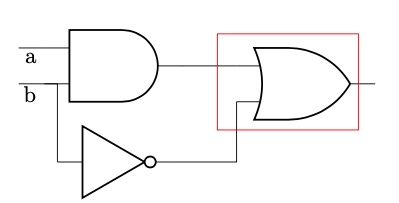

[toc]
# Boolean Algebra Basics
## Cofactor
令$F(x_1,\cdots,x_n)$为一个$n元布尔函数$
* Positive cofactor related to $x_i$
$F_{x_i}=F(x_1,\cdots,x_i=1,\cdots,x_n)$
* Negtive Cofactor related to $x_i$
$F_{x_i'}=F(x_1,\cdots,x_i=0,\cdots,x_n)$
## Cofactor properties
* 取反
$(F')_x = (F_x)'$
* 二元运算
$(F\cdot G)_x=F_x\cdot G_x$
$(F+G)_x=F_x+G_x$
$(F\oplus G)_x=F_x\oplus G_x$
## 香农展开
$$F(x_1,\cdots,x_n)=x_iF_{x_i}+x_i'F_{x_i'}$$
也可以对多个变量进行展开
$$F(x_1,\cdots,x_n)=x_ix_jF_{x_ix_j}+x_ix_j'F(x_ix_j')+x_i'x_jF_{x_i'x_j}+x_i'x_j'F_{x_i'x_j'}$$
其中$F_{x_ix_j'}=F(x_1,\cdots,x_i=1,\cdots, x_j=0,\cdots,x_n)$, 其他项依此类推。
# Boolean Difference
* 布尔函数$F$关于$x$的导数定义为
$$\frac{\partial F}{\partial x}=F_x\oplus F_{x'}$$
意义$\frac{\partial F}{\partial x}=1时，x的取值变化时F也会发生变化$
## Boolean difference properties
* 导数与变量顺序无关
 $$\frac{\partial F}{\partial x \partial y}=\frac{\partial F}{\partial y\partial x}$$
* 导数的异或等于异或的导数
$$\frac{F\oplus G}{\partial x}=\frac{\partial F}{\partial x}\oplus \frac{\partial G}{\partial x}$$
* 常量函数的导数为0
* 与和或的导数
$$\frac{\partial}{\partial x}(F\cdot G)=(F\cdot \frac{\partial G}{\partial x})\oplus (G\cdot \frac{\partial F}{\partial x})\oplus (\frac{\partial F}{\partial x}\frac{\partial F}{\partial x})$$
$$\frac{\partial}{\partial x}(F + G)=(F'\cdot \frac{\partial G}{\partial x})\oplus (G'\cdot \frac{\partial F}{\partial x})\oplus (\frac{\partial F}{\partial x}\frac{\partial F}{\partial x})$$
# Quantification Operators
## Universal quantification
$\forall_xF=F_x\cdot F_{x'}$
**意义：**$\forall_xF=1$时其他变量的值能够让$F$对于任意的$x$都是1
$e.g:令F=xy + x'z$
$F_x=y, F_{x'}=z$
$\forall_xF=F_x\cdot F_{x'}=yz$
$\forall_xF=1\Rightarrow yz=1\Rightarrow y=1, z=1$
$F_{y=1,z=1}=x+x'=1\Rightarrow \forall x都有F_{y=1,z=1}=1$
## Existential quantification
$\exist_xF=F_x + F_{x'} $
**意义：**$\exist_xF=1$ 时其他变量的值能使得存在一个 $x$ 让 $F$ 为1
$e.g:令 F=xy + x'z$
$F_x=y, F_{x'}=z$
$\exist_xF = F_x + F_{x'}= y + z$
令 $\exist_xF=1\Rightarrow y=1\ or\ z=1$
$F_{y=1}=x+x'z\Rightarrow \exist x=1\ 使得 \ F_{y=1}=1$
$F_{z=1}=xy+x'\Rightarrow \exist x=0\ 使得\ F_{y=1}=1$
## Additional properties
$\forall_{xy}F=\forall_x(\forall_yF)=F_{xy}\cdot F_{xy'}\cdot F_{x'y}\cdot F_{x'y'}$
$\exist_{xy}F=\exist_x(\exist_yF)=F_{xy} + F_{xy'} + F_{x'y} + F_{x'y'}$
# Application To Logic Network Repair
需要一个电路来实现 $f(a,b)=ab + b'$ 的逻辑功能，假设实现错了一个gate，如图中的红色框部分，需要修复它并得到它正确实现时的逻辑门。

如下图，首先将错误的gate用一个 4:1 来代替，引入了四个新的变量，我们可以将这四个新的变量取不同的值来模拟任意的逻辑门。

接下来构建一个新的逻辑函数$Z(ab,d1,d2,d3,d4)$使得它仅在 $f==G$ 时恒为1，如下图所示，只需要将 G 与 f 的正确实现进行同或即可得到相应的函数 $Z$

现在想得到的是一组mux的输入 $d0, d1, d2, d3$ 使得对于所有的 $a,b$ 都有 $Z==1$，通过universal quantification能够得到该问题的答案，即通过
$$\forall_{ab}Z=1$$
求出对应的$d_0, d_1, d_2, d_3$的取值。
上图中mux的输出
$$G(a,b,d_0, d_1, d_2, d_3)=d_0a'b+d_1b'+d_2ab$$
$$Z=G\overline{\oplus}f$$$$Z_{ab}=G_{ab}\overline{\oplus}f_{ab}$$$$Z_{ab'}=G_{ab'}\overline{\oplus}f_{ab'}$$$$Z_{a'b}=G_{a'b}\overline{\oplus}f_{a'b}$$$$Z_{a'b'}=G_{a'b'}\overline{\oplus}f_{a'b'}$$$$\forall_{ab}Z=Z_{ab}Z_{a'b}Z_{ab'}Z_{a'b'}=d_0'd_1d_2=1\Rightarrow $$$$d_0=0, d_1=1, d_2=1, d_3=x$$
如果 $d_3$ 取1，该mux实现的是一个or gate，如果 $d_3$ 取0，该mux实现的是一个exor gate，因此使用or或者exor均可实现对该网络的修复。
# Recursive tautology
## Tautology
一个布尔函数 $f$ 如果恒为真则可以将其称为tautology，本节阐述如何判断一个布尔函数是不是tautology
## Positional Cube Notation(PCN)
如果将一个布尔函数表示为SOP形式，则可以用PCN来表示，用一个cube来表示SOP中的单个乘积项，用2bit的slot来表示一个单变量，01表示乘积项中包含该变量，10表示乘积项中包含该变量的反变量，11表示乘积项中不包含该变量的原变量或者反变量，如 $abc, abc', bc$分别可以表示为：
$abc\ : [01\ 01\ 01]$
$abc': [01\ 01\ 10]$
$bc\ \ \ : [11\ 01\ 01]$
如果需要将两个乘积项相与只需要将cube中对应slot分别相与即可得到结果，如果结果中包含00的slot，说明两个乘积项中分别包含该slot所对应变量的原变量和反变量，此时可以认为该cube为0。
对于一个SOP，可以用一个cube list来表示一个，如 $f(a,b,c)=a+bc+ab$ 可以表示为：
$[01\ 11\ 11], [11\ 01\ 01], [01\ 01 11]$
## Cofactor与tautology
$f$ 是 tautology 当且仅当 $f_x$ 和$f_{x'}$ 都是 tautology
**证明：**
    如果 $f()==1$ ,显然 $f_x$ 和 $f_{x'}$ 均为1
    如果 $f_x=1, f_x'=1$, 根据香农展开式，$f()=xf_x + x'f_{x'} = x + x' = 1$  
## 递归方法
如果不能判断出f是否是tautology，可以求出f关于某个变量的Positive cofactor 和 Negative cofactor，然后分别判断cofactor是不是tautology，使用此方法需要确定一些机制
* 变量选取规则：选取哪个变量来求cofactor
* 终止规则：什么时候可以断定 $f==1$ 或者 $f != 1$ 并终止递归
* cofactor的表示方法
